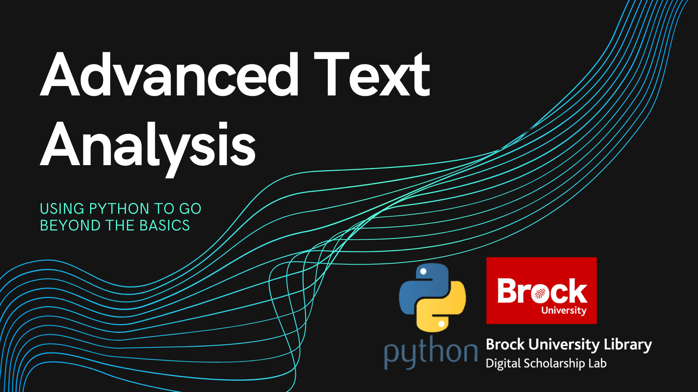

# Advanced Text Analysis with Python

A workshop that introduces more complex text analysis techniques, including topic modeling, and text similarity.

## Getting Started

Click the blue button to launch the tutorial material in the Google Collab environment. Please be aware that you'll need a Google Account to access the service.

**This tutorial is brought to you by the Brock University Digital Scholarship Lab.  For more information on the DSL check out our website at [www.brocku.ca/library/dsl/](https://brocku.ca/library/dsl/) or you can e-mail us at dsl@brocku.ca.**  

[Upcoming Workshops](https://brockdsl.eventbrite.com)

You can also find us on:  
[Facebook](https://www.facebook.com/Brock-University-Digital-Scholarship-Lab-349407235866792/)  
[Twitter](https://twitter.com/brock_dsl)  
[Instagram](https://www.instagram.com/brock_dsl/?hl=en)  
[YouTube](https://www.youtube.com/channel/UC2eEqPkDo-1N3qilxv-N_1g/featured?view_as=subscriber)
